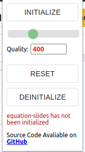
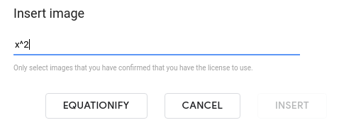

# `equation-slides`

This is the repository for the Equation Slides chrome extension. It allows you to "Insert equations in Google Slides".

## Documentation

### Popup

Here is an image of the popup:

At the top is the initialize button. To start up Equation Slides, don't click the `Initialize` button first! First, go to `Insert > Image > By URL`. Then click on the `Close` button. Now the `Initialize` button can be clicked. To deinitialize Equation Slides, click on the `Deinitialize` button. Now, to reinitialize Equation Slides, you can click on the `Initialize` button again. If at any time the quality of the equation is wanted to be changed, then the slider can be dragged or the number input can be used. To reset the quality value back to 400, use the `Reset` button.

### Google Slides

Here is an image of the new Insert Image By URL popup:

If the `Equationify` button is pressed, then the equation will convert into a usable URL with the equation. Instead of typing in the equation and then pressing on the `Equationify` button, you can paste in \`x^2\` and it will automatically convert into a URL.

## Development

**This assumes you have `npm` and `google-chrome` installed**

Starting up in the development environment:

1. Run `npm run dev` at the root of this repository
2. Open up `chrome://extensions` in `google-chrome`
3. Make sure developer mode is turned on
4. Click on Load Unpacked and select the `dist/` folder at the root of this repository
